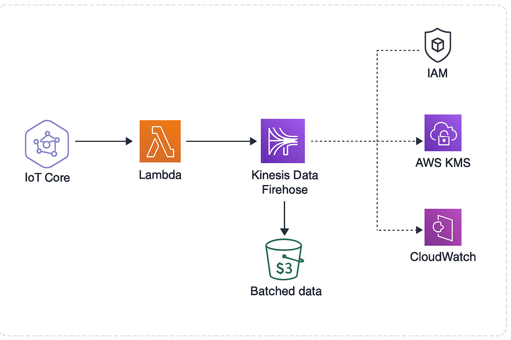

## Project Overview

This project implements a real-time, cost-effective, and serverless data pipeline for monitoring apartment energy consumption using AWS-native services. An IoT-enabled energy meter sends readings to AWS IoT Core, which routes the data to an AWS Lambda function. The Lambda function performs lightweight processing and streams the data into Amazon S3 via Kinesis Data Firehose for storage and analysis.

### Key Features
- Real-time data ingestion and processing
- Fully serverless and scalable architecture
- Cost-optimized using native AWS services
- Secure with encryption in transit and at rest

## Service Choices

- **AWS IoT Core**  
  Chosen for secure, scalable ingestion of telemetry data from the energy meter. Supports MQTT for low-latency message delivery.

- **AWS Lambda**  
  Enables serverless compute for lightweight, event-driven processing. Reduces infrastructure management overhead and scales automatically.

- **Amazon Kinesis Data Firehose**  
  Handles real-time data delivery with built-in support for S3, minimizing operational complexity and providing near real-time delivery guarantees.

- **Amazon S3**  
  Used for durable, cost-effective object storage. S3 supports high availability and lifecycle policies for archival and data retention.

- **AWS IAM**  
  Ensures secure and restricted access to services. Roles and policies enforce least-privilege permissions for all components.

- **CloudWatch**  
  Used for monitoring Lambda execution logs, debugging, and operational visibility.

# apartment-energy-monitoring
IoT-based serverless data pipeline for monitoring apartment energy consumption using AWS services (IoT Core, Lambda, Firehose, S3).
